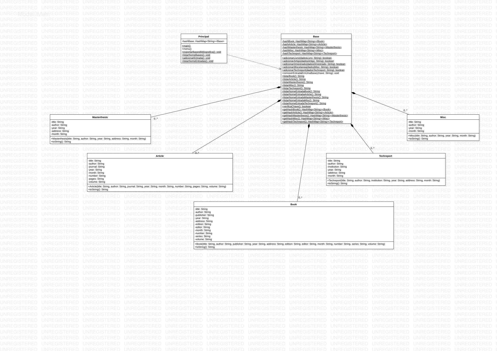

# Gerenciador de bibliografias

> Engenharia de Telecomunicações - Programação Orientada a Objetos (POO29004)
> 
> Instituto Federal de Santa Catarina - campus São José

## Arquivo BibTeX

Um arquivo [BibTeX](https://pt.wikipedia.org/wiki/BibTeX) contém entradas diferentes para representar os diversos tipos de publicação. Cada tipo possui um conjunto de atributos opcionais e um conjunto de atributos obrigatórios. Por exemplo, o tipo `book` tem como atributos obrigatórios: *author*, *publisher*, *title* e *year*. Já como atributos opcionais tem-se: *address*, *edition*, *month*, *number*, *series* e *volume*.

Na tabela abaixo é apresentado um subconjunto de todos os tipos previstos para um arquivo BibTeX, bem como a lista com um subconjunto de todos os atributos obrigatórios e opcionais para cada um deles.

> `o` para atributos opcionais e `+` para atributos obrigatórios. Em branco significa que o atributo não pertence àquele tipo de publicação.


|             | article | book | masterthesis | misc | techreport |
| ----------- | :-----: | :--: | :----------: | :--: | :--------: |
| address     |         |  o   |      o       |      |     o      |
| author      |    +    |  +   |      +       |  o   |     +      |
| edition     |         |  o   |              |      |            |
| editor      |         |  o   |              |      |            |
| institution |         |      |              |      |     +      |
| journal     |    +    |      |              |      |            |
| month       |    o    |  o   |      o       |  o   |     o      |
| number      |    o    |  o   |              |      |            |
| pages       |    o    |      |              |      |            |
| publisher   |         |  +   |              |      |            |
| series      |         |  o   |              |      |            |
| title       |    +    |  +   |      +       |  +   |     +      |
| volume      |    o    |  o   |              |      |            |
| year        |    +    |  +   |      +       |  o   |     +      |

### Formato das entradas

Cada entrada no arquivo BibTeX é precedida pelo símbolo `@` e tem seu bloco delimitado pelos símbolos `{` e `}`. Abaixo é apresentado um exemplo para a entrada do tipo livro:

```bibtex
@book{lamport1994latex,
  title={LATEX: a document preparation system: user's guide and reference manual},
  author={Lamport, Leslie},
  year={1994},
  publisher={Addison-wesley}
}
```

Note que cada entrada é composta por um conjunto pares `chave=valor`. Os valores devem ser colocados dentro de um bloco delimitado pelos símbolos `{` e `}`. O símbolo `,` (vírgula) é usado para separar os pares `chave=valor`.

Cada entrada no BibTeX precisa ter um identificador único. Esse identificador é colocado logo quando se abre o bloco da entrada. No exemplo acima, o identificador da entrada é `lamport1994latex`. Sendo assim, nesse arquivo BibTeX não pode-se ter outra entrada que possua esse mesmo identificador.

## Projeto

Faça uma modelagem em UML para representar um aplicativo que permita a gestão de várias bases de bibliografia do usuário. Por exemplo, eu poderia usar o aplicativo para gerenciar uma base de bibliografia específica para um artigo que estou escrevendo e uma outra base de bibliografia específica para as notas de aulas da disciplina de Programação Orientada a Objetos. 

Cada base bibliográfica será composta por publicações do tipo *article*, *book*, *masterthesis*, *misc* ou *techreport*. Cada tipo de publicação possui seu conjunto de atributos opcionais e obrigatórios, conforme apresentado na tabela da seção anterior. Deve-se respeitar as particularidades de cada tipo de publicação. Por exemplo, eu não poderia criar uma publicação do tipo *article* que contenha o atributo `series`.

Por fim, implemente em Java o modelo desenvolvido. O aplicativo a ser desenvolvido deverá possuir pelo menos as seguintes funcionalidades:

- Exportar uma base bibliográfica no formato BibTeX (gerar uma String que poderá ser impressa na tela)
- Criar, listar e remover bases bibliográficas
- Adicionar, listar e remover entradas em uma base bibliográfica

**Atenção:** Não é necessário desenvolver uma interface com o usuário. Ou seja, não precisa fazer um menu onde o usuário poderá interagir para executar as funcionalidades apresentadas acima. Para testar, pode-se instanciar objetos das classes desenvolvidas diretamente no método `main` da classe Principal.

### Entregas e formato de entrega

- Arquivo `.png` com o diagrama de classes UML na raiz do repositório e referenciado dentro do arquivo `Readme.md`.
- Projeto gradle (criado com o IntelliJ) na raiz do repositório
  - Conjunto de classes Java dentro do projeto
- [Gitignore](http://gitignore.io/) adequado para as ferramentas usadas no projeto
- Certifique-se que será possível compilar o projeto após fazer o clone do repositório


### UML do projeto

