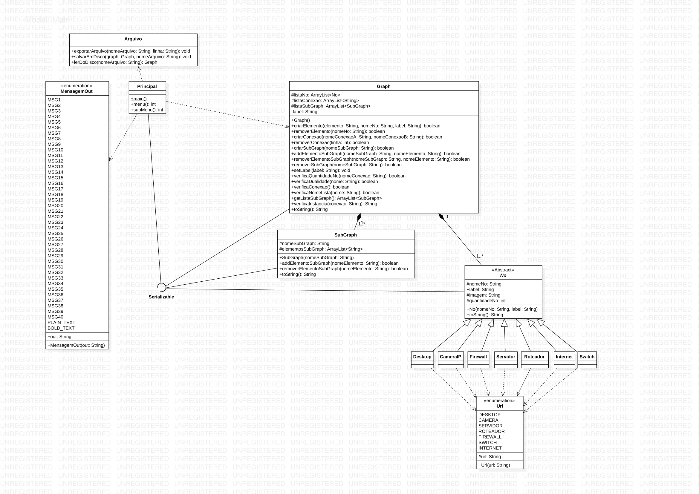

### Implementações
Foram realizadas todas as especificações, dentre elas, estão:
- Nomear um Graph
- Salvar um Graph
- Carregar um Graph em memória
- Mostrar Graph
- Adicionar um SubGraph
- Remover um SubGraph
- Adicionar elemento ao Graph
- Remover elemento do Graph
- Adicionar elemento ao SubGraph
- Remover elemento do SubGraph
- Realizar conexões
- Exportar arquivo como .dot

### UML do projeto
