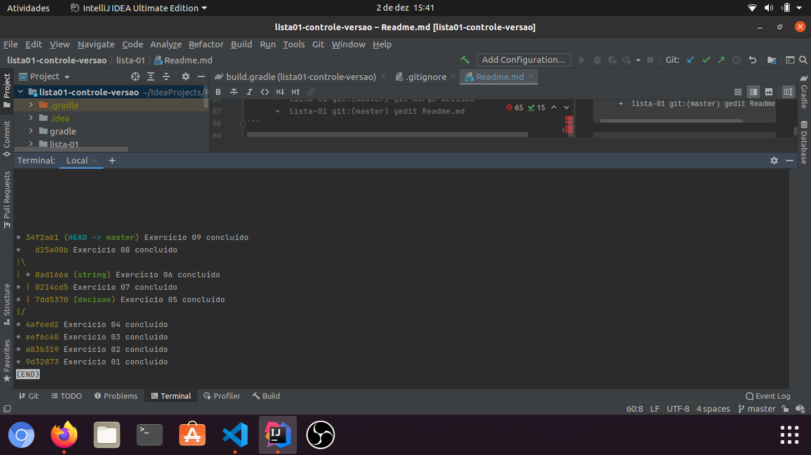

# Comandos git e linguagem de programação Java
## Linguagem de programação Java
- Estruturas de decisão
```javascript
public static void main(String[] args){
    int idade, r;
    int n1 = 4;
    int n2 = 8;
    boolean l = true;
    String op = null;

    Scanner teclado1 = new Scanner(System.in);
    Scanner teclado2 = new Scanner(System.in);

    while (l) {
        System.out.println("Qual sua idade?");
        idade = teclado1.nextInt();

        if (idade > 18) {
            System.out.println("Você pode dirigir");
        } else {
            System.out.println("Você não pode dirigir");
        }

        //operador ternário, recebe 0, se não recebe 1
        r = (n1 > n2) ? 0 : 1;
        System.out.println(r);

        System.out.println("Deseja sair? (S/N)");
        op = teclado2.nextLine();

        switch (op){
            case "S":
                l = false;
                System.out.printf("Você finalizou o programa!");
                break;
            case "N":
                l = true;
                break;
            default:
                System.out.println("Operador inválido");
        }
    }
}
```
- Métodos da classe `String`
```javascript
package aula2;

public class Caneta {
    String modelo;
    String cor;
    float ponta;
    int carga;
    boolean tampada;

    void rabiscar (){
        if (this.tampada == true){
            System.out.println("Erro! Não posso escrever");
        }else{
            System.out.println("Estou Rabiscando...");
        }
    }

    void tampar(){
        this.tampada = true;
    }

    void destampar(){
        this.tampada = false;
    }

    void status(){
        System.out.println("Modelo: " + this.modelo);
        System.out.println("Uma caneta " + this.cor);
        //THIS retorna ele mesmo, ou seja retorna que chamou o objeto
        System.out.println("Ponta: " + this.ponta);
        System.out.println("Carga: " + this.carga);
        System.out.println("Está tampada? " + this.tampada);
    }

}

        package aula2;
        public class Aula2 {
    		public static void main (String[] args){
       		Caneta c1 = new Caneta();
        		c1.cor = "Azul";
        		c1.ponta = 0.5f; //f define o tipo, pode usar o typecast
        		c1.tampar();
        		c1.rabiscar();
        		c1.status();

    		}
	  }
```
- Interação com o usuário
```javascript
        import java.util.Scanner;

            public class Principal {
                private static boolean Null;
                public static void main(String[] args){

                    String nome = null;
                    int idade;
                
                    Scanner teclado = new Scanner(System.in);
                
                    System.out.println("Qual seu nome?");
                    nome = teclado.nextLine();
                
                    System.out.println("Olá " + nome + ", tudo bem?");
                
                    System.out.println("Qual sua idade?");
                    idade = teclado.nextInt();
                
                    int ano_nasc = 2020 - idade;
                    System.out.println("Legal, "+ nome + "! Você nasceu em " + ano_nasc);

                }
            }
```

### Comandos git
-  Fluxo de trabalho usando ramos
```bash 
      ➜  lista-01 git:(string) git checkout master 
      ➜  lista-01 git:(master) git merge decisao
      ➜  lista-01 git:(master) gedit Readme.md 
``` 

```bash 
      ➜  lista-01 git:(master) git checkout master 
      ➜  lista-01 git:(master) git merge string
      ➜  lista-01 git:(master) git rebase --contine
      ➜  lista-01 git:(master) gedit Readme.md 
``` 

